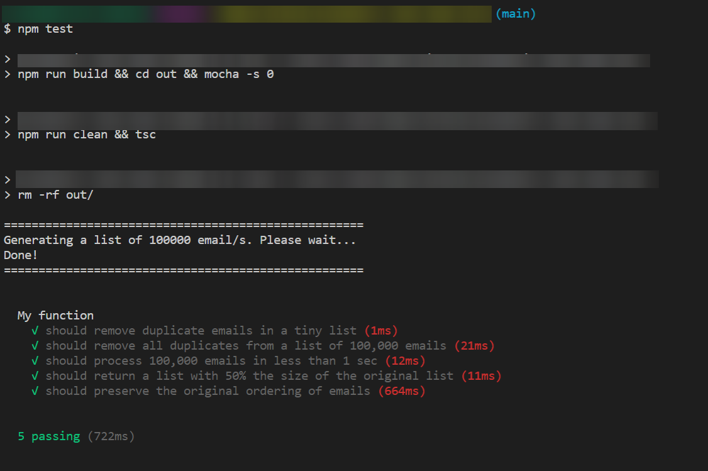

# Take-Home Test

This repo contains my answer to the take-home test.

The problem statement is in `problem.txt`.

My solution to the problem is in `src/answer.ts`.

The test suite for my solution is in `test/test.answer.ts`.

I chose TypeScript as the language to solve the test, and Mocha as the testing framework.

## System Requirements

In order to run the tests, your system should have Node.js installed.

## How to Run the Tests

1. Navigate to the root directory, and install the dependencies.

   ```bash
   $ npm install
   ```

1. Run the `npm` command to run the tests.

   ```bash
   $ npm test
   ```

1. You should see an output similar to this. Notice that all tests are passing.
   
